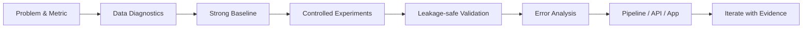

<!--
  Kawsar Ahmmed — GitHub Profile README
  Design goal: recruiter-first, modern, visual, and technically credible.
  Replace/add LinkedIn, email, portfolio, and resume links when ready.
-->

 

<!--
Add these when your URLs are ready:

-->

  

<a href="#engineering-profile">Engineering Profile</a>&nbsp;&nbsp;•&nbsp;&nbsp;
<a href="#featured-engineering">Featured Engineering</a>&nbsp;&nbsp;•&nbsp;&nbsp;
<a href="#technology-stack">Technology Stack</a>&nbsp;&nbsp;•&nbsp;&nbsp;
<a href="#engineering-workflow">Workflow</a>&nbsp;&nbsp;•&nbsp;&nbsp;
<a href="#more-selected-work">More Work</a>

---

## Engineering Profile

I build **machine learning and AI systems end to end** — from data understanding and experimental baselines to evaluation, model integration, APIs, retrieval pipelines, and usable applications.

My work spans **classical ML, deep learning, computer vision, agentic AI, and retrieval-augmented generation**. I prefer evidence over unnecessary complexity: establish a strong baseline, validate correctly, inspect failure modes, then engineer the parts that actually improve the system.

<table>
<tr>
<td width="50%" valign="top">

### Applied Machine Learning

Tabular modelling, biomedical ML, feature engineering, model comparison, cross-validation, ensemble evaluation, and leakage-aware experimentation.

</td>
<td width="50%" valign="top">

### Agentic AI & RAG

Multi-agent workflows, retrieval pipelines, vector search, grounded generation, model orchestration, and LLM-backed applications.

</td>
</tr>
<tr>
<td width="50%" valign="top">

### Deep Learning & Vision

PyTorch/TensorFlow experimentation, image classification, representation learning workflows, and model evaluation for visual tasks.

</td>
<td width="50%" valign="top">

### AI Engineering

FastAPI/Flask services, WebSocket applications, modular pipelines, Docker/Linux workflows, reproducible repositories, and system integration.

</td>
</tr>
</table>

---

## Featured Engineering

> Four projects that best represent how I work across **ML research, AI systems, RAG, deep learning, and application engineering**.

<table>
<tr>
<td width="50%" valign="top">

### 01 / InterviX Aura

**Multi-Agent AI Interview System**

A browser-based mock-interview system built around coordinated **Interviewer, Candidate, and Evaluator agents**, with real-time communication between the client and backend.

**System flow**  
`Browser` → `WebSocket` → `FastAPI` → `AutoGen Agent Team` → `Evaluator Feedback`

**Engineering focus**
- Role-specific multi-agent orchestration
- Real-time WebSocket interaction
- Dedicated evaluator-agent feedback loop
- Hosted and local model support
- Separation of model clients, agent logic, UI, and tests

`AutoGen AgentChat` `FastAPI` `WebSocket` `Gemini` `Ollama`

</td>
<td width="50%" valign="top">

### 02 / VitalVox Medical RAG

**Retrieval-Augmented Medical Assistant**

A Flask-based RAG application that converts medical PDFs into retrievable knowledge and uses source-grounded context to support LLM responses.

**RAG flow**  
`PDFs` → `Chunking` → `Embeddings` → `Pinecone` → `Retrieved Context` → `LLM Response`

**Engineering focus**
- PDF ingestion and chunking pipeline
- Pinecone-backed vector retrieval
- Source-grounded generation workflow
- Gemini + optional local Ollama support
- Multipage UI with source previews and runtime checks

`LangChain` `Pinecone` `Flask` `Gemini` `Ollama` `RAG`

</td>
</tr>
<tr>
<td width="50%" valign="top">

### 03 / Mechanisms of Action

**Biomedical Multi-Label Machine Learning**

An end-to-end ML workflow for predicting drug **Mechanisms of Action** from gene-expression features, cell-viability signals, and treatment metadata.

**ML flow**  
`Omics Features` → `EDA` → `Feature Engineering` → `Multi-Label Models` → `Ensemble Evaluation`

**Engineering focus**
- Multi-source biomedical feature integration
- Structured experimentation and EDA
- Feature engineering for high-dimensional data
- Multi-label modelling workflow
- Repository separation across data, notebooks, source, models, outputs, and reports

`Multi-Label Classification` `Biomedical ML` `Feature Engineering` `Ensembles`

</td>
<td width="50%" valign="top">

### 04 / German Traffic Sign Recognition

**PyTorch Computer Vision / Image Classification**

A deep-learning image-classification project organized around a reproducible visual-recognition workflow with dedicated notebook and reusable source-code components.

**Vision flow**  
`Images` → `Preprocessing` → `PyTorch Training` → `Evaluation` → `Inference Workflow`

**Engineering focus**
- Image preprocessing pipeline
- PyTorch-based model experimentation
- Separation of exploratory notebooks and reusable code
- Training and evaluation workflow for visual recognition

`PyTorch` `Computer Vision` `Deep Learning` `Image Classification`

</td>
</tr>
</table>

---

## Technology Stack

### Core Engineering

  

### ML / Data

### Agentic AI / RAG / LLM

### Backend / Systems

---

## Engineering Workflow

<table>
<tr>
<td width="25%" align="center"><b>01</b> Understand the target, constraints, and metric.</td>
<td width="25%" align="center"><b>02</b> Inspect data quality, distributions, and leakage risk.</td>
<td width="25%" align="center"><b>03</b> Build a strong reference before adding complexity.</td>
<td width="25%" align="center"><b>04</b> Change one meaningful thing at a time.</td>
</tr>
<tr>
<td width="25%" align="center"><b>05</b> Validate with a split strategy that matches the problem.</td>
<td width="25%" align="center"><b>06</b> Study errors, weak cases, and unstable behavior.</td>
<td width="25%" align="center"><b>07</b> Turn successful experiments into reusable systems.</td>
<td width="25%" align="center"><b>08</b> Iterate only when evidence justifies it.</td>
</tr>
</table>

---

## More Selected Work

<table>
<tr>
<td width="33%" valign="top">

### Ames Price Regression

Advanced supervised regression with meaning-aware preprocessing, feature construction, cross-validation, model comparison, and ensemble modelling.

`Regression` `CatBoost` `SVR` `Stacking`

[Open repository →](https://github.com/kawsar07ahmmed0712-rgb/Ames-Price-Regression)

</td>
<td width="33%" valign="top">

### Credit Default Risk

Tabular classification project focused on structured credit-risk analysis, preprocessing, feature investigation, and predictive modelling.

`Classification` `Tabular ML` `EDA` `Risk Modelling`

[Open repository →](https://github.com/kawsar07ahmmed0712-rgb/Credit_Default_Risk)

</td>
<td width="33%" valign="top">

### Excel Analytics Dashboard

Spreadsheet analytics project for transforming structured data into an interactive dashboard and business-facing reporting workflow.

`Excel` `Dashboarding` `Analytics` `Reporting`

[Open repository →](https://github.com/kawsar07ahmmed0712-rgb/Excel_Dashboard)

</td>
</tr>
</table>

---

## GitHub Pulse

<b>Open contribution activity</b>

 

<picture>
  <source media="(prefers-color-scheme: dark)" srcset="https://github-readme-activity-graph.vercel.app/graph?username=kawsar07ahmmed0712-rgb&theme=tokyo-night&hide_border=true&area=true" />
  <source media="(prefers-color-scheme: light)" srcset="https://github-readme-activity-graph.vercel.app/graph?username=kawsar07ahmmed0712-rgb&theme=github-compact&hide_border=true&area=true" />
  
</picture>

<!--
OPTIONAL CONTRIBUTION SNAKE
1. Add the companion .github/workflows/snake.yml file provided with this README.
2. Run the workflow once from GitHub Actions.
3. Uncomment this block.

## Contribution Trail

<picture>
  <source media="(prefers-color-scheme: dark)" srcset="https://raw.githubusercontent.com/kawsar07ahmmed0712-rgb/kawsar07ahmmed0712-rgb/output/github-snake-dark.svg" />
  <source media="(prefers-color-scheme: light)" srcset="https://raw.githubusercontent.com/kawsar07ahmmed0712-rgb/kawsar07ahmmed0712-rgb/output/github-snake.svg" />
  
</picture>
-->

---

## Contact

**Interested in AI engineering, applied ML, RAG systems, agentic workflows, and computer vision.**

<!-- Add LinkedIn / Email / Portfolio / Resume buttons here when ready. -->

