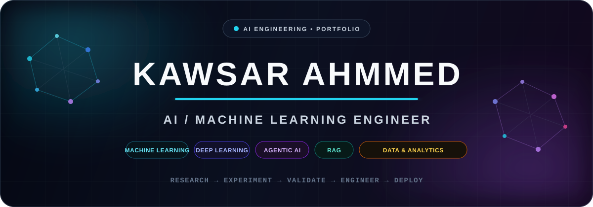

````md
<!-- ========================================================= -->
<!-- KAWSAR AHMMED — GITHUB PROFILE                            -->
<!-- AI / ML / LLM / AGENTIC AI ENGINEERING PORTFOLIO         -->
<!-- ========================================================= -->

<div align="center">



<br/>

<a href="https://github.com/kawsar07ahmmed0712-rgb">
  
</a>


</div>

<br/>

---

## `01` — Engineering Profile

```python
class KawsarAhmmed:
    role = "AI / Machine Learning Engineer"

    focus = [
        "Agentic AI",
        "LLM Systems",
        "Retrieval-Augmented Generation",
        "Deep Learning",
        "Computer Vision",
        "Production Machine Learning"
    ]

    engineering_style = [
        "Research-driven",
        "Experiment-first",
        "Evaluation-focused",
        "End-to-end systems"
    ]

    current_goal = "Build intelligent systems that survive real-world evaluation."
````

I design and build **end-to-end AI systems** — from data exploration and experimentation to model evaluation, retrieval pipelines, LLM orchestration, APIs, and production-oriented applications.

My work spans **classical machine learning, deep learning, computer vision, NLP, RAG, and agentic AI**, with a strong focus on rigorous experimentation rather than notebook-only demos.

<br/>

---

## `02` — What I Build

<table>
<tr>

<td width="25%" valign="top">

### 🤖 Agentic AI

Multi-agent systems
Agent orchestration
Tool-using workflows
Autonomous reasoning
Evaluation pipelines

</td>

<td width="25%" valign="top">

### 🧠 LLM Systems

RAG pipelines
Dense retrieval
Reranking
Grounded generation
LLM applications

</td>

<td width="25%" valign="top">

### ⚙️ Machine Learning

Tabular modelling
Feature engineering
Cross-validation
Error analysis
Model calibration

</td>

<td width="25%" valign="top">

### 👁️ Deep Learning

Transformers
Computer vision
Neural networks
Representation learning
Transfer learning

</td>

</tr>
</table>

<br/>

---

## `03` — Featured Engineering Projects

<table>
<tr>
<td width="50%" valign="top">

### 🤖 InterviX Aura

**Multi-Agent AI Interview System**

An intelligent interview simulation platform built around collaborating AI agents for interviewer, candidate, and evaluation workflows.

**Engineering**

`AutoGen` `FastAPI` `WebSocket`
`Gemini` `Ollama` `Multi-Agent AI`

**Focus**

* Multi-agent orchestration
* Real-time interaction
* Automated evaluation
* Multi-provider LLM support
* Production-style API architecture

<br/>

<a href="https://github.com/kawsar07ahmmed0712-rgb/InterviX_Aura">
  
</a>

</td>

<td width="50%" valign="top">

### 🩺 VitalVox

**Medical Retrieval-Augmented Generation System**

A source-grounded medical AI assistant combining retrieval infrastructure with modern LLM generation.

**Engineering**

`LangChain` `Pinecone` `Flask`
`Gemini` `Ollama` `RAG`

**Focus**

* Document retrieval
* Vector search
* Context-grounded answers
* Source-aware responses
* End-to-end RAG workflow

<br/>

<a href="https://github.com/kawsar07ahmmed0712-rgb/End_to_End_Medical_Chatbot">
  
</a>

</td>
</tr>
</table>

<br/>

> **More flagship systems are currently being cleaned and documented.**
> The goal is to expose engineering decisions, experiments, failure analysis, and reproducible results — not just source code.

<br/>

---

## `04` — Research → Engineering Workflow

<div align="center">

```text
┌──────────────────┐
│   Problem / Goal │
└────────┬─────────┘
         ↓
┌──────────────────┐
│ Data & Diagnostics│
└────────┬─────────┘
         ↓
┌──────────────────┐
│ Baseline Models  │
└────────┬─────────┘
         ↓
┌──────────────────┐
│ Experimentation  │
└────────┬─────────┘
         ↓
┌──────────────────┐
│ Robust Validation│
└────────┬─────────┘
         ↓
┌──────────────────┐
│ Error Analysis   │
└────────┬─────────┘
         ↓
┌──────────────────┐
│ System Design    │
└────────┬─────────┘
         ↓
┌──────────────────┐
│ API / Deployment │
└──────────────────┘
```

</div>

<br/>

---

## `05` — Technical Arsenal

<div align="center">

### Core Languages


<br/><br/>

### Machine Learning & Deep Learning


<br/><br/>

### AI / Data Ecosystem


<br/><br/>

### Backend & Infrastructure


<br/><br/>

### Databases & Retrieval


</div>

<br/>

---

## `06` — ML Engineering Principles

<table>
<tr>
<td width="33%" align="center">

### 🔬 Experiment

Strong baselines
Controlled comparisons
Ablation thinking

</td>

<td width="33%" align="center">

### 📊 Evaluate

Leakage awareness
Cross-validation
Error analysis

</td>

<td width="33%" align="center">

### 🚀 Engineer

Modular systems
API integration
Reproducibility

</td>
</tr>
</table>

<br/>

---

## `07` — Areas of Active Work

```text
Agentic AI               ████████████████████
Retrieval + RAG          ████████████████████
Machine Learning         ████████████████████
Deep Learning            ███████████████████░
Computer Vision          ███████████████████░
LLM Evaluation           ██████████████████░░
MLOps / Deployment       █████████████████░░░
```

> These bars represent areas of technical focus — not arbitrary self-rated proficiency scores.

<br/>

---

## `08` — Research & Experimentation

I care about the parts of machine learning that are often hidden behind the final metric:

* Dataset diagnostics
* Feature behaviour
* Leakage detection
* Group-aware validation
* Out-of-fold evaluation
* Baseline strength
* Failure-mode analysis
* Probability calibration
* Retrieval quality
* Reranking
* Evidence selection
* Model comparison
* Reproducible experimentation

<br/>

---

## `09` — Currently Exploring

<table>
<tr>
<td>

**Agentic Systems**

* Multi-agent collaboration
* Planning and tool use
* Agent memory
* Agent evaluation
* Reliable orchestration

</td>

<td>

**Advanced RAG**

* Hybrid retrieval
* Query understanding
* Cross-encoder reranking
* Context construction
* Grounded generation

</td>

<td>

**Applied ML Research**

* Robust validation
* Ensemble systems
* Representation learning
* Calibration
* Error-driven iteration

</td>
</tr>
</table>

<br/>

---

## `10` — GitHub Activity

<div align="center">


</div>

<br/>

---

## `11` — Engineering Philosophy

<div align="center">

### **Research deeply. Validate rigorously. Engineer systems that actually work.**

`Data → Evidence → Model → Evaluation → System`

</div>

<br/>

---

## `12` — Connect

<div align="center">

<a href="YOUR_LINKEDIN_URL">
  
</a>

<a href="mailto:YOUR_EMAIL">
  
</a>

<a href="YOUR_PORTFOLIO_URL">
  
</a>

</div>

<br/>

<div align="center">

<sub>
AI Engineering • Machine Learning • Deep Learning • LLM Systems • Agentic AI
</sub>

<br/><br/>

**© Kawsar Ahmmed**

</div>
```
