

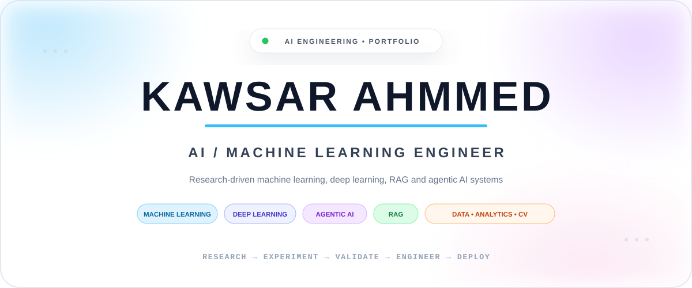

 

<a href="#featured-work"><b>PROJECTS</b></a>
&nbsp;&nbsp;•&nbsp;&nbsp;
<a href="#technical-stack"><b>STACK</b></a>
&nbsp;&nbsp;•&nbsp;&nbsp;
<a href="#engineering-method"><b>METHOD</b></a>
&nbsp;&nbsp;•&nbsp;&nbsp;
<a href="#github-activity"><b>ACTIVITY</b></a>
&nbsp;&nbsp;•&nbsp;&nbsp;
<a href="#connect"><b>CONTACT</b></a>

  

 

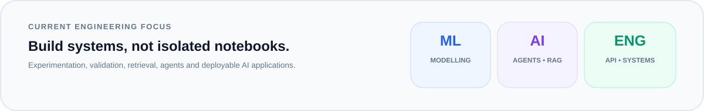

 

<table>
<tr>
<td width="25%" valign="top">

### 🤖 Agentic AI
Multi-agent workflows  
LLM orchestration  
Real-time interaction  
Evaluation pipelines

</td>
<td width="25%" valign="top">

### 🔎 RAG / LLM
Document retrieval  
Vector search  
Context grounding  
Model routing

</td>
<td width="25%" valign="top">

### ⚙️ Machine Learning
Feature engineering  
Cross-validation  
Model comparison  
Error analysis

</td>
<td width="25%" valign="top">

### 👁️ Deep Learning
PyTorch  
Computer vision  
Image classification  
Neural networks

</td>
</tr>
</table>

 

 

<table>
<tr>
<td width="50%" valign="top">
<a href="https://github.com/kawsar07ahmmed0712-rgb/InterviX_Aura">
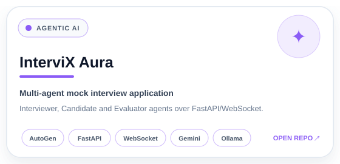
</a>
</td>
<td width="50%" valign="top">
<a href="https://github.com/kawsar07ahmmed0712-rgb/End_to_End_Medical_Chatbot">
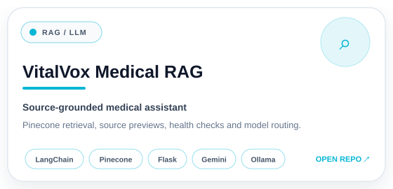
</a>
</td>
</tr>
</table>

 

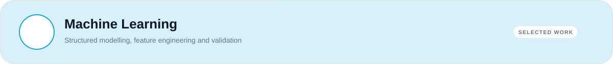

 

<a href="https://github.com/kawsar07ahmmed0712-rgb/moa-prediction-drug-response">
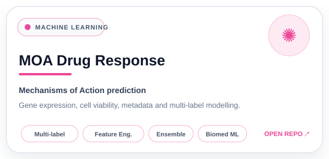
</a>

  

<table>
<tr>
<td width="50%" valign="top">
<a href="https://github.com/kawsar07ahmmed0712-rgb/Ames-Price-Regression">
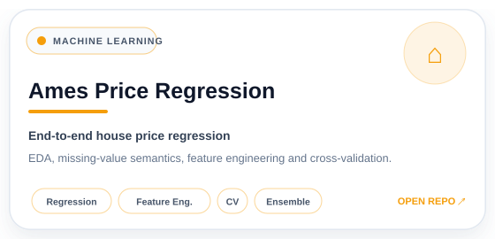
</a>
</td>
<td width="50%" valign="top">
<a href="https://github.com/kawsar07ahmmed0712-rgb/Credit_Default_Risk">
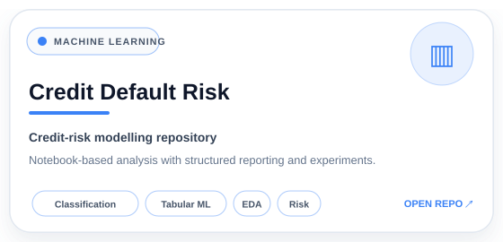
</a>
</td>
</tr>
</table>

 

 

<a href="https://github.com/kawsar07ahmmed0712-rgb/Pytorch-German-Traffic-Sign-Recognition">
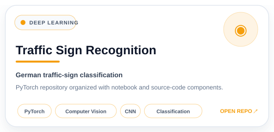
</a>

  

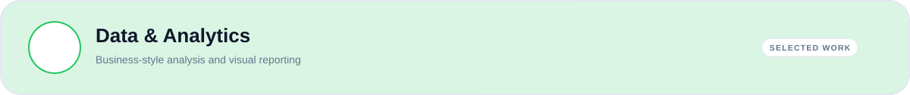

 

<a href="https://github.com/kawsar07ahmmed0712-rgb/Excel_Dashboard">
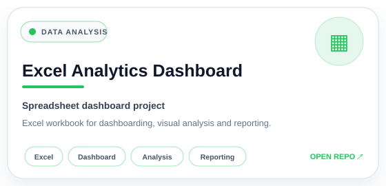
</a>

  

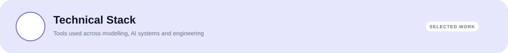

 

### Languages

 

### Machine Learning & Deep Learning

 

  

### LLM Systems / Agentic AI / RAG

  

### Backend / Data / Engineering

 

  

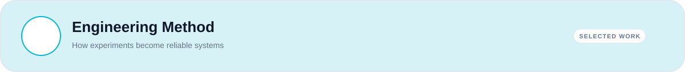

 

### `PROBLEM` → `DATA` → `DIAGNOSTICS` → `BASELINE` → `FEATURES` → `VALIDATION` → `ERROR ANALYSIS` → `SYSTEM`

 

<table>
<tr>
<td width="33%" align="center">

### 🔬 Experiment
Strong baselines  
Controlled comparisons  
Feature-driven iteration

</td>
<td width="33%" align="center">

### 📈 Validate
Leakage awareness  
Cross-validation  
OOF thinking  
Failure analysis

</td>
<td width="33%" align="center">

### 🚀 Engineer
Modular pipelines  
API integration  
Reproducibility  
Deployment thinking

</td>
</tr>
</table>

 

 

  

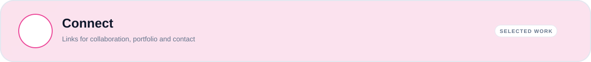

 

<!-- Replace the placeholders below -->

 

